# Math3D Mini Gallery

This file is a quick catalog of Geometry Viewer object cards and starter presets.

## Basic solids

| Preview | Object | Type | Description | Example presets |
| --- | --- | --- | --- | --- |
| 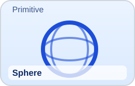 | Sphere | Primitive | Basic 3D primitive defined by center and radius. | Unit sphere, Large sphere |
| 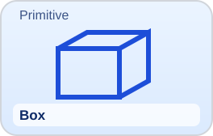 | Box | Primitive | Axis-aligned solid with editable width, height, and depth. | Unit box, Flat slab |
| 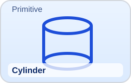 | Cylinder | Primitive | Radial solid with top and bottom radii plus segment controls. | Unit cylinder, Tall column |
| 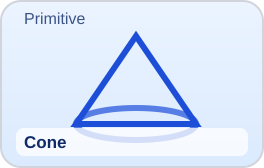 | Cone | Primitive | Tapered primitive controlled by radius, height, and segments. | Default cone, Wide cone |
| 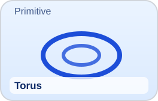 | Torus | Primitive | Ring primitive defined by major radius and tube radius. | Standard torus, Thin torus |
| 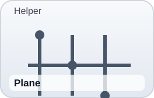 | Plane | Helper | Infinite plane helper with orientation presets. | XY, XZ, YZ (planned) |

## Polyhedra

| Preview | Object | Type | Description | Example presets |
| --- | --- | --- | --- | --- |
|  | Tetrahedron | Polyhedron | Regular tetrahedron family card. | Regular, Subdivided |
| 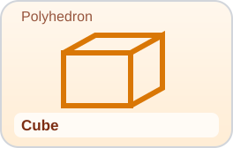 | Cube | Polyhedron | Platonic cube with optional subdivisions. | Unit, Subdivided |
| 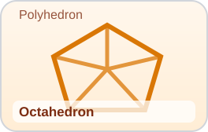 | Octahedron | Polyhedron | Eight-faced Platonic solid. | Regular, Smooth |
| 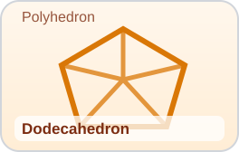 | Dodecahedron | Polyhedron | Twelve-faced Platonic solid. | Classic, Expanded |
| 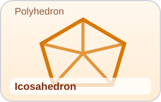 | Icosahedron | Polyhedron | Twenty-faced Platonic solid. | Regular, Geodesic seed |
| 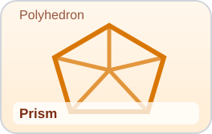 | Prism | Polyhedron | N-sided prism family. | Hex prism, Oct prism |
| 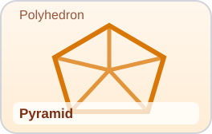 | Pyramid | Polyhedron | N-sided pyramid family. | Square pyramid, Pentagonal pyramid |

## Curves and lines

| Preview | Object | Type | Status |
| --- | --- | --- | --- |
| 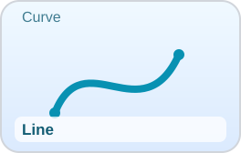 | Line | Curve | Planned |
| 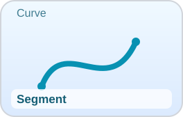 | Segment | Curve | Planned |
| 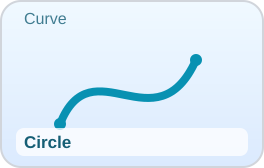 | Circle | Curve | Planned |
| 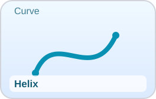 | Helix | Curve | Planned |
| 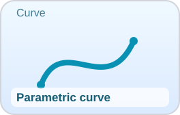 | Parametric curve | Curve | Planned |

## Analytic surfaces

| Preview | Object | Type | Status |
| --- | --- | --- | --- |
|  | Explicit surface | Surface | Planned |
| 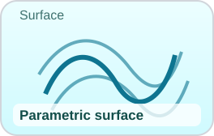 | Parametric surface | Surface | Planned |
| 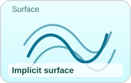 | Implicit surface | Surface | Planned |

## Special mathematical surfaces

| Preview | Object | Type | Status |
| --- | --- | --- | --- |
| 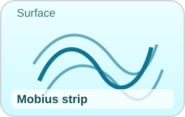 | Mobius strip | Surface | Planned |
| 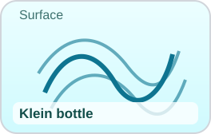 | Klein bottle | Surface | Planned |
| 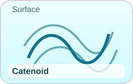 | Catenoid | Surface | Planned |
| 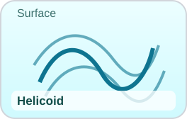 | Helicoid | Surface | Planned |
| 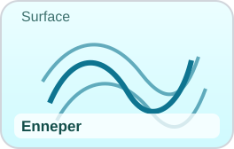 | Enneper | Surface | Planned |
| 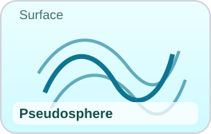 | Pseudosphere | Surface | Planned |

## Reference / helper objects

| Preview | Object | Type | Status |
| --- | --- | --- | --- |
|  | Point | Helper | Planned |
| 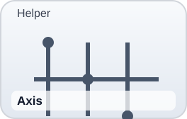 | Axis | Helper | Planned |
| 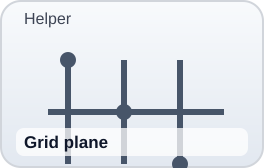 | Grid plane | Helper | Planned |
|  | Vector | Helper | Planned |
| 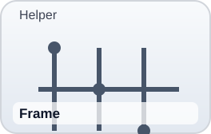 | Frame | Helper | Planned |
| 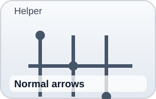 | Normal arrows | Helper | Planned |
