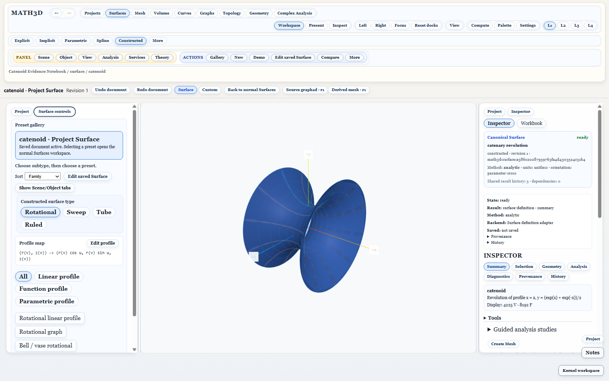
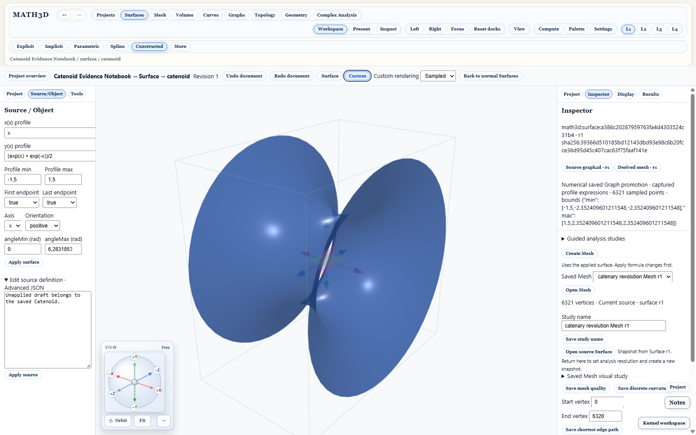

# Full Surfaces module as the primary Project view

Date: 2026-10-08. Checkout: `C:\Math3D`, based on main `0e6ead75`.

## Delivered behavior

- Selecting the saved Catenoid Surface opens the existing resizable Surfaces
  workspace: native left controls, middle `ParamSurfaceViewer`, and right module
  Inspector. The Project tree shares the left dock. **Surface controls** exposes
  the module controls; **Project** brings the document tree back.
- **Surface** and **Custom** explicitly select different workspaces. Custom keeps
  the separate document host and its Surface/Sampled rendering choice. Repeated
  selection is stable. Both retain the owning saved source, history and draft.
- Document activation and cold resume default to Surface for qualified captured
  Graph revolutions and open extrusions. Related Graph/Mesh links select their
  own documents. **Back to normal Surfaces** exits the saved document view.
- The gallery identifies the saved Surface and shows its construction family
  without highlighting an unrelated global preset. **Edit saved Surface** and
  **Edit profile** open the owning Object controls.
- The Surface Inspector reports its actual display tessellation. An unrelated
  Mesh's document identity, counts and diagnostics are absent. Saved Mesh
  studies remain available through their own document and linked study controls.
- Middle/All Project placement retains the existing viewer session beneath the
  Project content. Normal modules retain their existing workspace structure.

## Verification

Five distinct Electron flows passed across the focused runs:

1. Surface/Custom, unapplied draft and camera, related Graph/Mesh navigation,
   sampled choice, saved Mesh fields and cold restart.
2. Disabled resume and explicit recovery from a stale document selection.
3. Draft input during resource preparation prevents replacing the active workspace.
4. Full native layout, exactly one viewer, explicit/repeated view selection,
   honest gallery selection, owned display counts, Graph/Mesh return, Project
   save, cold restart, remembered Custom rendering and exit to normal Surfaces.
5. Native curvature and local probe/Euler analysis, profile editing and Undo,
   Project/Inspector dock switching without reading the saved Project again.

One earlier run failed because its test still selected the retired custom-shell
Source/Object tab. The test now selects the native Object panel; its final rerun
passed. The final two-flow rerun passed in 2.6 minutes.

Fifteen dock switches measured 802–1098 ms, passing the existing 1500 ms gate.
This is a focused desktop measurement, not a general performance qualification.
The renderer build and renderer/E2E type checks passed. The desktop shortcut
`MATH3D Electron.lnk` targets `C:\Math3D\start-electron.bat`, which runs the dev app.
Tests used temporary profiles; the user's running window was not restarted.

## Screenshots

Primary module view:

Explicit Custom view with Sampled rendering:

