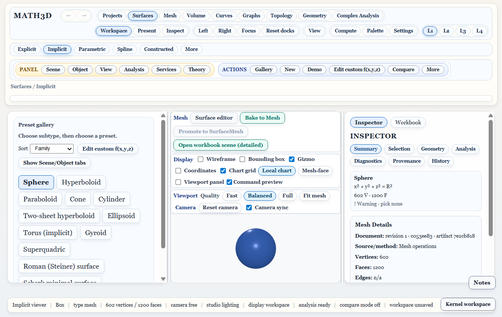

# Single startup recovery — October 9, 2026

The user's screenshot showed two competing startup flows: the existing
**Recover last autosave** prompt and the new **Opening saved Project** dialog.
They could apply different workspace snapshots during the same startup.

Startup now uses only the existing autosave recovery. Accept restores that
payload; decline continues in the normal workspace. Saved Projects stay in the
library and open explicitly through Projects. The automatic Project effect,
opening dialog, startup Resume banner and resume checkbox have been removed.
Legacy `resumeEnabled` values are ignored; panel placement and selected document
remain stored independently of scientific identity for explicit reopening.

Explicit Open retains resource validation, recoverable workspace backup,
concurrent-input protection and the recorded document selection. Cold-reopen
test journeys now perform a real saved-library Open instead of assuming startup
silently activates the Project.

## Checks

Two focused Electron startup tests passed in 58 seconds total. Each starts with
a saved Catenoid Project and the legacy automatic setting enabled. The test
handles the autosave confirmation in the renderer, once accepting and once
declining. It checks exactly one autosave prompt, the recovered Workbook title
when accepted, no automatic Project document/dialog/banner, and unchanged saved
Project bytes. Explicit library Open then displays Catenoid with its original
document ID/source hash, left Project tree and native viewer tools. No page
errors were reported. Tests use temporary profiles.

The six Project selection/preferences contract tests and renderer build passed.
Two existing Electron regressions also passed: stale selection recovers on
explicit Open, and source text typed during resource preparation survives the
rejected opening operation. Renderer and E2E type checks passed.
Older October 8 startup-modal evidence describes the superseded implementation.

