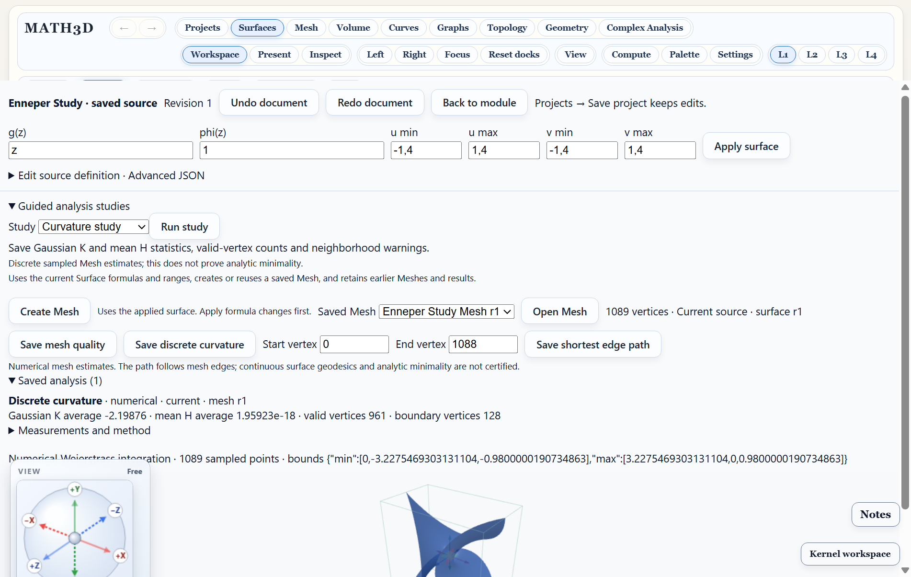
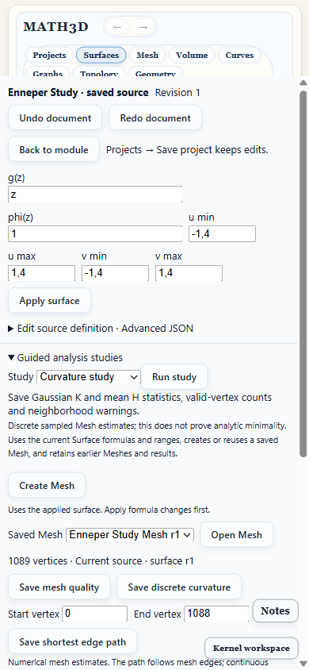

# PRJ36–38 desktop acceptance · October 5, 2026

The fixtures are the versioned 25-project Samsung collection. These checks ran
against the desktop renderer in isolated Electron profiles, with network requests
blocked during collection import. The user's desktop and phone libraries were
not acceptance profiles.

- [Model audit](model-acceptance.json): all 25 project identities and 108 documents;
  24 openable projects and one compatibility preview. Checks qualified saved Mesh
  quality/curvature operations, custom Graph/Surface edits and undo/redo, known
  derivative and provenance, existing result/resource retention, library reload
  and portable package round-trips. Generated by
  `renderer/src/projects/projectCollectionAcceptance.test.ts`.
- [Desktop audit](desktop-acceptance.json): per-document availability and reasons,
  actual Graph, Curve, Surface, sampled Surface, Mesh, Volume and Complex route
  opening, saved Surface curvature, 25 UI exports, 25 imports into a fresh library
  and exact payload retention after cold restart. Generated by
  `tests/e2e/project-analysis-collection.spec.ts`.
- `tests/e2e/project-analysis-studies.spec.ts`: native Helicoid and saved-source
  Enneper run Curvature, Mesh quality and Edge-path presets; invalid endpoints,
  repeat-result reuse, custom source edits and historical Mesh selection are
  checked. The native and saved-source Surface workflow regressions also pass.

The model audit executes quality/curvature for every advertised Surface/Mesh
entry in openable projects. The UI audit checks every availability row and
representative module routes; it does not execute every module operation. A
qualified route is not a claim that every mathematical operation is supported.
PRJ21 remains preview-only. No new physical-device acceptance is claimed.

The screenshots show Enneper's saved results after transfer and restart:

