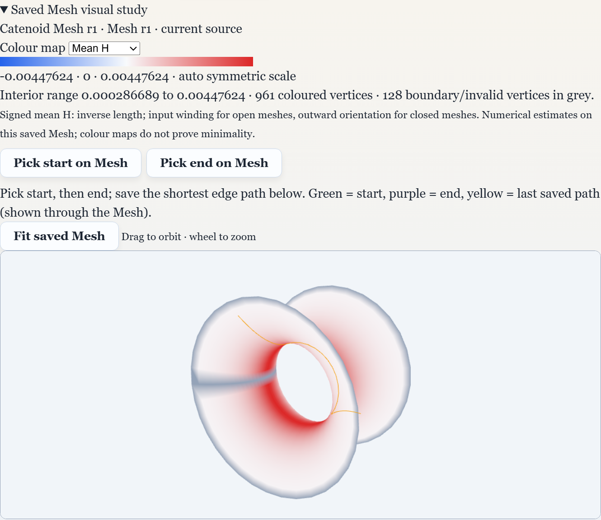
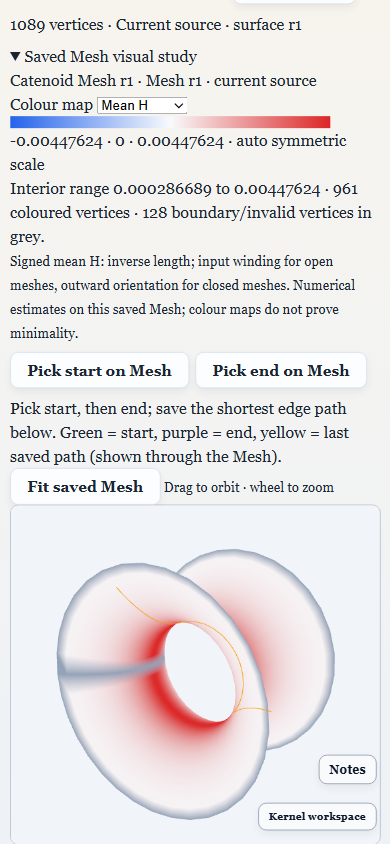

# PRJ39–PRJ41 desktop visual studies acceptance

October 5, 2026. Electron checks use fresh temporary libraries and the public
bundled Helicoid/Catenoid fixtures. The real user's library is not modified.

Delivered controls are **Guided analysis studies → Surface study setup**, then
**Saved Mesh visual study → Colour map / Pick start / Pick end**. Explicit setup
changes are undoable. Saved Mesh snapshots and qualified analysis results use
the existing verified project resource contract.

## Actual UI execution

`tests/e2e/project-surface-exploration.spec.ts` checks:

- Both Surface presets, editable parameters, invalid-input rejection and exact
  source undo/redo; original historical Mesh/results remain accessible.
- An edge-path study on a selected historical Mesh uses its exact identity
  without generating a replacement Mesh from newer Surface formulas.
- K/H selection on saved Catenoid buffers, with source identity and boundary
  exclusion in the legend.
- Real raycast canvas clicks choose distinct endpoint vertices. A drag leaves
  picking armed and does not select a vertex. The saved path's parameters and
  first/last vertex IDs match the picks.
- Export with verified resources, import into an independent fresh library and
  cold restart preserve the exact project payload, source generation, saved path
  and recomputed mean-curvature legend.
- A 390-pixel viewport has no horizontal overflow. The main viewer's floating
  status/navigation bars stay in document flow during the visual study.

[acceptance.json](acceptance.json) records the actual selected IDs, source hash,
path length and interior curvature range. Screenshots show the returned study:





The existing Helicoid/Enneper journeys in
`tests/e2e/project-analysis-studies.spec.ts` remain regression gates for all three
study kinds, custom edits, historical results and invalid endpoints.

```powershell
npx playwright test tests/e2e/project-surface-exploration.spec.ts tests/e2e/project-analysis-studies.spec.ts --reporter=list
```

## Model and build qualification

Seven tests across `surfaceStudyPresets.test.ts`, `savedMeshExploration.test.ts`,
`savedMeshStudies.test.ts` and `savedMeshAnalysis.test.ts` pass. They qualify finite
preset sampling, the Catenoid waist, preserved metadata/history, a flat interior,
positive sphere curvature, masked boundaries, unchanged buffers, coincident-sheet
vertex identity, bounded inputs and existing analysis provenance/path contracts.
Full TypeScript checking, E2E TypeScript checking and the renderer build pass.

Maps are discrete estimates on the selected saved Mesh. Boundary/invalid vertices
are grey; the colour scale is automatic and symmetric around zero. Signed mean H
uses the backend's stated winding/orientation convention. Colour buffers are
recomputed from verified Mesh resources; map selection itself is transient UI
state. Yellow paths follow Mesh edges and are drawn through the Mesh for visibility.
These checks do not certify analytic minimality, continuous geodesics, unsupported
Surface representations or new Android/iOS builds.
