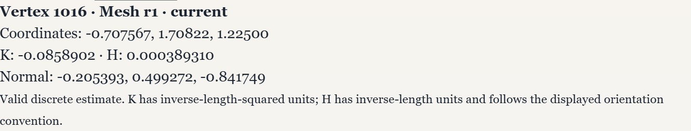
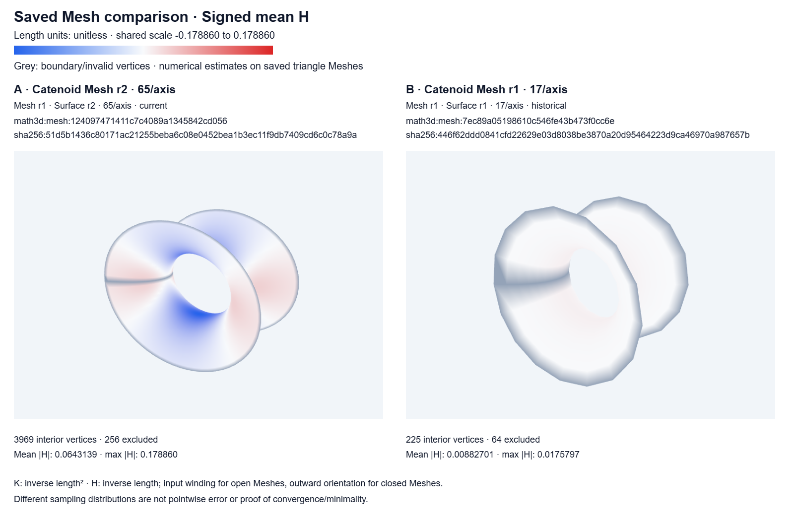
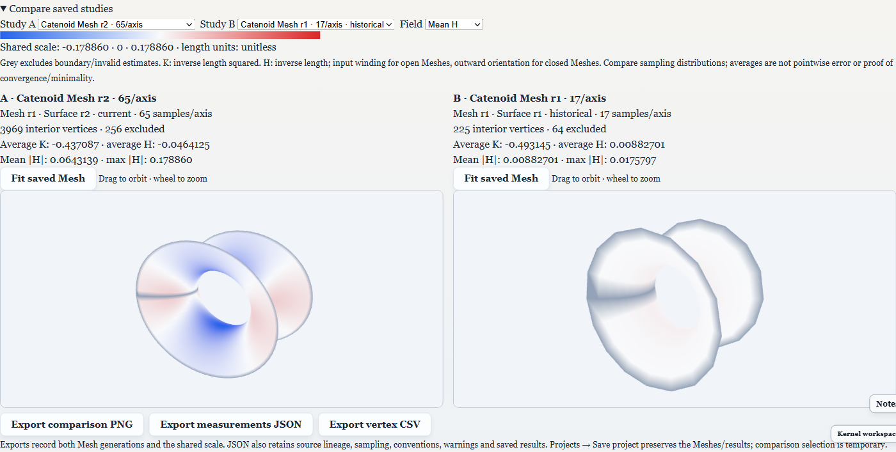
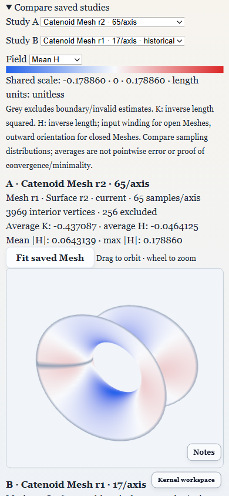
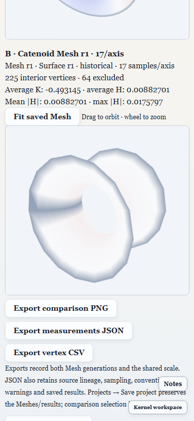

# PRJ42–PRJ44 desktop inspection, resolution and comparison

October 5, 2026. Checks use fresh temporary Electron profiles and public bundled
Catenoid data. The real desktop library is not modified.

Use **Projects → Open Analysis → Guided analysis studies**, choose **Analysis
resolution**, and **Run study**. **Saved Mesh visual study** supports ordinary
click inspection and armed endpoint picking. After creating two snapshots,
**Compare saved studies** provides A/B selection, a shared K/H scale, interior
statistics and PNG/JSON/CSV export.

## Actual desktop execution

`tests/e2e/project-study-comparison.spec.ts` verifies:

- Real canvas inspection, coordinates/normal display, unchanged path endpoints,
  boundary warnings, keyboard inspection and drag rejection.
- Medium/coarse/fine snapshots with 1089/289/4225 vertices, repeat reuse, inspection
  clearing when a smaller snapshot is selected, and retained original studies
  after a custom coordinate edit.
- Comparison across source revisions and resolution settings; identical-snapshot
  rejection and the same signed colour scale for both canvases.
- Actual Electron PNG, JSON and CSV downloads. The PNG is 1600 × 1060; measurement
  files retain both generation identities, masks and 4514 exact vertex rows.
- Verified-resource export, independent fresh-library import and cold restart
  preserve the exact saved project and recomputed shared scale.
- Both stacked comparison canvases are reachable at 390-pixel width, without
  horizontal overflow.

[acceptance.json](acceptance.json) records source generations, sampling, interior
statistics and scale from that execution.











The Helicoid/Enneper guided-study and PRJ39–41 exploration journeys remain
regression checks for presets, history, exact endpoint picking and portable paths.

```powershell
npx playwright test tests/e2e/project-study-comparison.spec.ts tests/e2e/project-surface-exploration.spec.ts tests/e2e/project-analysis-studies.spec.ts --reporter=list
```

## Model qualification

Model tests qualify flat interior inspection, boundary/invalid warnings, exact
resolution sampling and reuse, resource retention, five Surface sampler types,
unchanged recipes, signed shared scales, source generation export, validity masks
and unit mismatch rejection. A custom paraboloid test checks that sampled K at
the center approaches its known value 4 as resolution increases. This known-case
check does not establish general convergence/error bounds.

The comparison uses the existing discrete triangle backend and excludes boundary
or invalid estimates from interior statistics and colour scaling. JSON exports
state method/version, conventions and warning flags. Invalid values are null in
JSON and blank in CSV. Differing samples are not pointwise correspondences;
mean H depends on the stated orientation convention. The acceptance is desktop
only and does not qualify new Android/iOS builds or unsupported sources.
