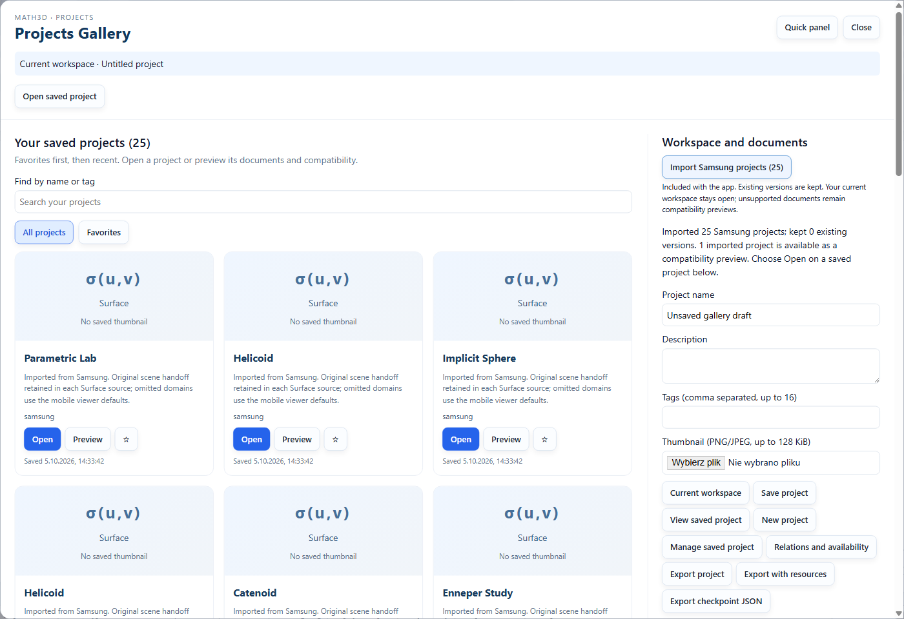
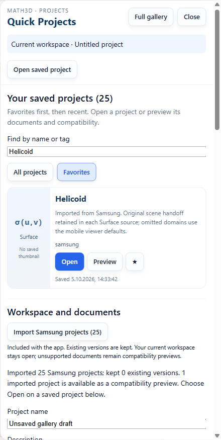
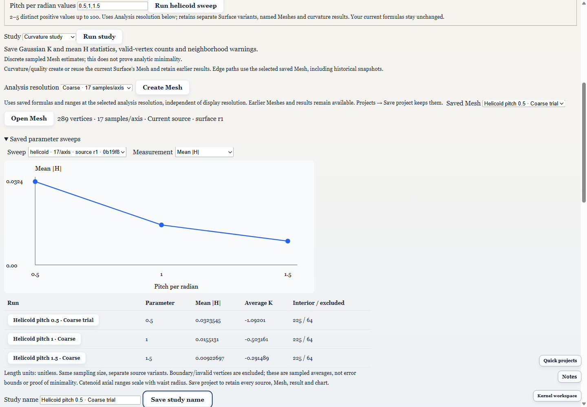
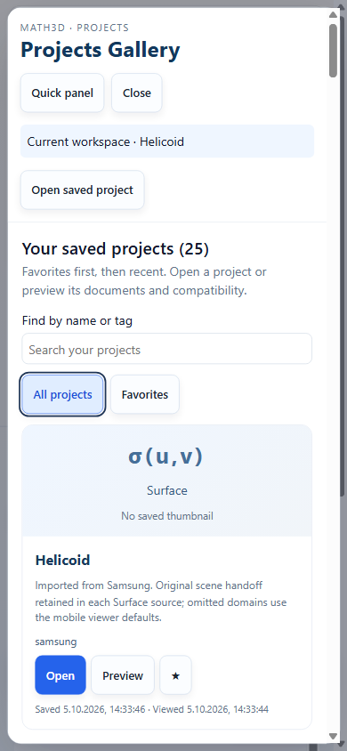
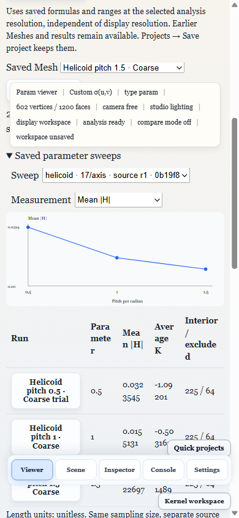

# PRJ45–PRJ47 desktop gallery and saved study runs

October 5, 2026. Electron checks use isolated temporary profiles and the public
bundled project collection. They do not modify the user's desktop library.

## Where to use the features

- **Projects** in the top navigation opens the centered **Projects Gallery**.
  Saved cards fill the main area; workspace controls and documents sit alongside
  them. Search by name/tag, choose Favorites, open a project or preview it. The
  header's **Quick panel** switches to the right overlay; **Full gallery** returns
  to the center with the same draft metadata, search and collection. **Quick
  projects** near the lower-right corner opens that panel directly.
- Open a saved Surface's **Open Analysis**, then **Guided analysis studies**.
  **Analysis resolution** controls new saved Mesh sampling. An opened Mesh offers
  **Open source Surface** and explains where resolution belongs. Historical
  Meshes identify the snapshot revision and open the current source explicitly.
  Meshes without retained Surface lineage show an unavailable reason.
- **Study name → Save study name** labels the selected Mesh. Its geometry,
  generation and results stay unchanged. **Save project** retains the name,
  including rename undo/redo replay and resource transfer. Comparison PNG/JSON
  uses these names; CSV includes a protected study-name column.
- In **Guided analysis studies**, choose Helicoid or Catenoid and enter 2–5
  distinct positive parameter values, up to 100, in **Parameter sweep**. **Run
  sweep** creates independent Surface variants, named Meshes and curvature
  results at the selected analysis resolution. The open Surface stays unchanged.
  **Saved parameter sweeps** charts mean |H| or average K and links to each run.

## Qualification

The focused Electron journeys exercise the centered and quick layouts, imported
25-project library, filtering/favorites, preview/direct opening, preserved draft
metadata, Escape and 390-pixel layout. The bundled collection contains two
independent Helicoid projects; searching displays both rather than merging them.

The Helicoid sweep retains .5, 1 and 1.5 pitch variants with 289 vertices each,
including a custom run name. Repeat runs reuse unchanged snapshots. Source return,
named comparison JSON, verified-resource export, independent-library import and
cold restart retain source generations, names, measurements and the chart. The
Catenoid waist sweep uses .8 and 1.2 with Fine sampling: 4,225 vertices, 3,969
interior vertices and 256 excluded vertices per Mesh. Its K/H summaries retain
sampling and qualifications without replacing the original formulas.

Existing Helicoid/Enneper study, curvature map, real canvas picking and comparison
exports remain regression checks. Historical-source checks also exercise the
return to a newer Surface source. Study workspaces scroll vertically and reserve
native viewer height, including when desktop controls consume the window height.
JSON source-editor expanders use an explicit selector alongside guided studies.

The 47 targeted model checks cover exact source/sampling lineage, safe reuse,
replay/resources, metadata-only names, name undo/redo, exported names and CSV
protection, both sweep families, rejected input and failed numerical variants,
original-source retention, edited-Mesh replacement and historical freshness
before the next project capture. Full TypeScript checks and renderer build pass.

The final Electron qualification passes all 14 selected journeys: the three new
gallery/sweep cases, both historical-source return cases, existing exploration
and comparison/export cases, supported/preview-only project cards, both additional
source-editor transfers, built-in starter histories, Volume recovery, named
mobile-model transfer and native document navigation. The affected tests ran on
the final renderer build:

```powershell
npx playwright test tests/e2e/project-gallery-sweeps.spec.ts tests/e2e/project-analysis-studies.spec.ts tests/e2e/project-surface-exploration.spec.ts tests/e2e/project-study-comparison.spec.ts tests/e2e/unified-projects.spec.ts --grep 'Projects opens|named Helicoid|Catenoid waist|PRJ36|saved Catenoid|Helicoid and|PRJ42|saved project cards|built-in source starters|additional source editors' --output test-results/prj45-final --reporter=list
npx playwright test tests/e2e/unified-projects.spec.ts --grep 'PRJ01/PRJ02|PRJ08 named|PRJ14 restores' --timeout=300000 --output test-results/prj45-library-final --reporter=list
```

Results: **11 passed (7.4m)** and **3 passed (1.4m)**. The earlier broader run
also passed the existing Geometry refresh, Graph history, Mesh resource/replay,
Topology/Complex history, document management, dependency inspection and transfer
journeys. Initial failures led to the source-freshness/viewport fixes and precise
legacy test selectors; all affected journeys passed in the final runs above.
The e2e TypeScript project also passes after those test updates.

Before pushing, remote main advanced to `9b5c923` with the independent Quantum
scene importer. Integration merge `d05ec58` preserved that work. The combined
main-process build, synthetic verified-bundle/tamper checks and e2e TypeScript
checks pass. The three gallery/sweep journeys plus the Quantum desktop picker
test were rerun against that build: **4 passed (2.3m)**.

[acceptance.json](acceptance.json) records exact source generations, parameters,
sampling, interior statistics and resource/restart evidence from actual execution.











The estimates use the existing discrete Mesh curvature backend. Boundary and
invalid vertices are excluded from sweep statistics. Connecting sample averages
is a visualization, not an analytic law, certified error bound or proof of
minimality. Catenoid axial domains scale with waist radius. Each run retains its
source generation, units and sampling; saved results are not silently recomputed.
This delivery qualifies desktop workflows, not a new Android/iOS build.
