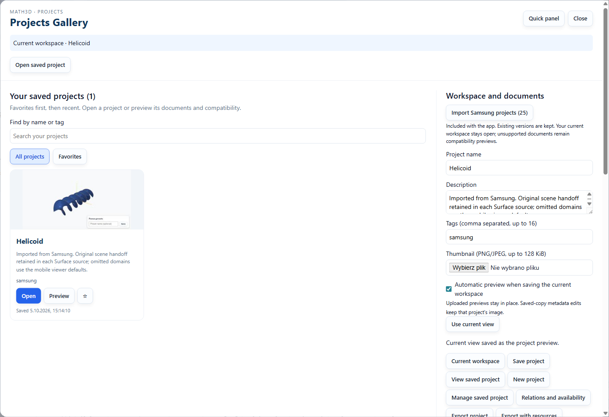
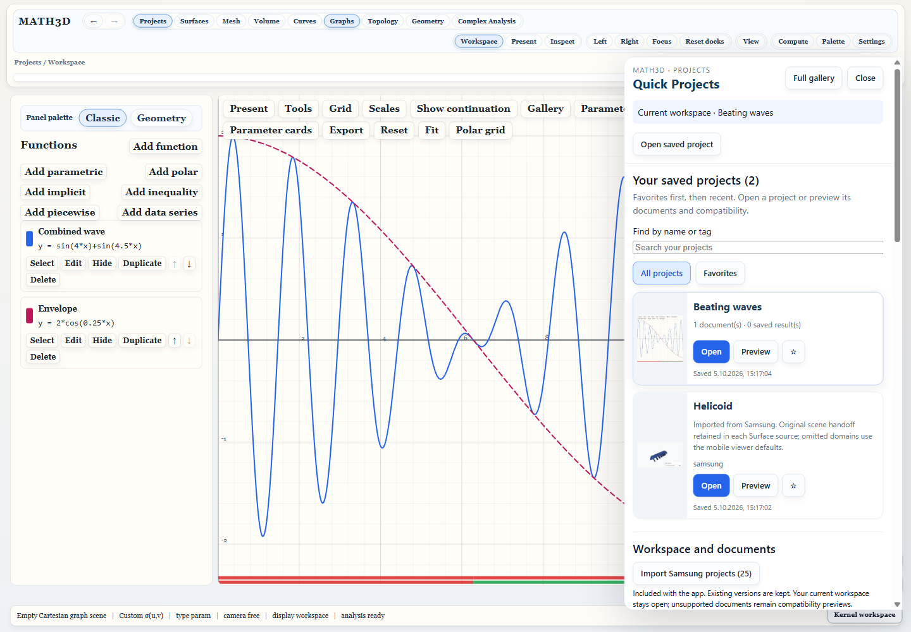
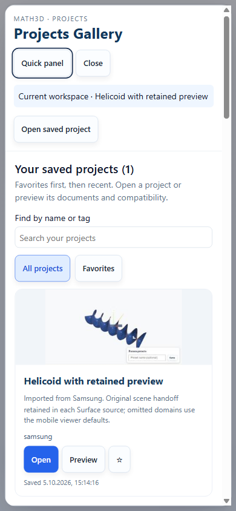

# PRJ48 automatic desktop project previews

October 5, 2026. Qualification uses isolated temporary Electron profiles. The
user's real desktop library and running window are not modified by these checks.

## Delivered behavior

Open a document, set the view you want, then choose **Projects → Save project**.
**Automatic preview when saving the current workspace** is enabled by default.
The visible render surface becomes the gallery card's image. Future saves update
automatic images; unchecking the option keeps the image in place. The right
**Quick projects** panel supports the same capture behavior.

Uploading a PNG/JPEG takes precedence and remains an override on later saves.
**Use current view**, then **Save project**, explicitly replaces it with an
automatic preview. Editing a different saved project's metadata keeps that
project's image and does not capture the active viewer or activate the saved copy.

Capture uses the actual compositor image of the largest visible canvas or Graph
plot within the active module; additional saved-source viewers have a separate
scope. The Projects overlay and its backdrop are concealed during capture and
restored afterward. Window bounds and desktop zoom are accounted for. The image
keeps its aspect ratio, fits within 320×200 pixels and is a JPEG below 128 KiB.
Capture is in memory: no screenshot file or dialog is created for normal saving.

Preview bytes and an optional automatic-image marker remain local sidecars.
Neither enters scientific source hashes, project JSON or resource packages. The
strict v1 project-library index format stays unchanged. Legacy/uploaded previews
are manual; the automatic marker must match the exact saved image bytes.

If capture is unavailable, times out or observes a changed workspace, the project
still saves with its previous preview. A missing visible viewer is reported and
keeps the gallery fallback. Optional automatic-image quota failures roll back the
image attempt and save the project/resources with the old image. Manual-upload
failures keep the existing atomic save behavior.

Imported examples are not silently opened or rendered. Open and save one to give
it a current-view preview. Automatic capture is a desktop feature; browser-only
hosts retain upload support and receive an unavailable message when appropriate.

## Acceptance

The new Electron journeys exercise real Surface and Graph renders, camera changes,
actual image decoding/color content, scientific-generation retention, automatic
refresh, uploaded overrides, explicit replacement, capture failure, invalid
capture rectangles, quick-panel capture, disabling capture, saved-copy metadata
management and cold restart. The gallery remains within a 390-pixel viewport.

The Surface capture decodes as 320×177 pixels with 4,570 distinct RGB colors.
[acceptance.json](acceptance.json) records those measured checks;
[graph-acceptance.json](graph-acceptance.json) records Graph and saved-copy checks.
The model library/transfer suite passes 17 tests, including unchanged project
bytes, exact automatic markers, manual/legacy image retention and quota rollback.
Node, renderer and e2e TypeScript checks and the desktop build pass.

Final Electron command:

```powershell
npx playwright test tests/e2e/project-thumbnails.spec.ts tests/e2e/unified-projects.spec.ts --grep 'PRJ48|PRJ03 persists|PRJ08 named|saved project cards' --output test-results/prj48-final --reporter=list
```

Result: **5 passed (1.6m)**. The capture tests size the actual Electron window,
rather than relying only on an emulated Playwright viewport. Evidence screenshots
and JPEGs were inspected after the final run.






