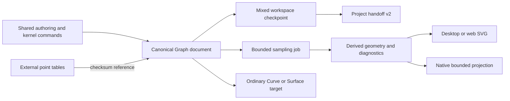

# Graph2D architecture, schemas, algorithms and platform parity

Maintained G2D35 guide, 2026-09-28. Sequencing and acceptance authority: [Graph2D roadmap](math3d-graph2d-desktop-mobile-roadmap.md). Software evidence: [G2D33 round trip](graph2d-g33-round-trip-acceptance.md), [G2D34 corpus](graph2d-g34-parity-corpus.md). Physical release gate: [MOB-G11–13 acceptance](mobile-graphs-g11-g13-acceptance.md).

## Ownership and data flow

| Layer | Owns | Main source locations |
| --- | --- | --- |
| Core | Portable schemas, validation/migration, AST parser/evaluator, source identity, authoring actions, bounded sampling, numerical analysis, point-table contracts, Curve/Surface promotions and handoff validation | `packages/core/src/graph2d*.ts`, `mixedWorkspace.ts`, `workspaceProjectHandoff.ts` |
| Kernel | Command transactions, generation advancement, undo/redo and shared Graph adapter | `packages/kernel/src/graph2dCommandAdapter.ts`, `inMemoryDocumentKernel.ts` |
| Desktop/web | Graph workspace, authoring/inspector, SVG presentation, worker ownership, pointer/keyboard interactions, local sidecar backing and file transfer | `renderer/src/graph2d/`, `renderer/src/components/KernelWorkspacePanel.tsx` |
| Mobile | Ordinary project library/files/share, native controls, gesture preview, scheduled sampling, workload adaptation, native geometry projection and tablet panels | `apps/mobile/src/MobileGraphsWorkspace.tsx`, `models/mobileGraph*.ts`, `viewer/mobileGraph*.ts`, `useMobileGraphSampling.ts` |
| Tests/evidence | Portable recipes, analytic/tolerance oracles, host regressions and exact-device attestations | `packages/core/fixtures/graph2d/`, `tests/unit/mobileGraph*.test.ts`, `tests/e2e/graph2d*.spec.ts`, `tests/graph2d-web/`, `scripts/mobile-graph-device-gate.mjs` |

Core and kernel must not depend on React, DOM, Electron or native APIs. Host adapters supply storage, timing, worker ownership and presentation; mathematical definitions remain shared.



## Document and identity contract

`math3d.graph2d-document`, schema version 1, has exactly these top-level fields:

| Field | Meaning |
| --- | --- |
| `format`, `schemaVersion` | Portable envelope/version |
| `identity` | Stable document ID, revision, source structural SHA-256 and identity schema version |
| `requiredCapabilities` | Exact computed capability set for object kinds, optional saved probes and parameter controls |
| `source` | Ordered objects, named numeric variables (optional validated range/step/unit controls) and assumptions; mathematical authority |
| `display` | Viewport, axes/grid policy, per-object styles, saved sampling intent and optional pins |
| `selection` | Selected object and finite source-linked probe, including parameter/row identity where applicable |
| `metadata` | Title |

The document limit is 256 KiB, with at most 64 objects. Validation checks strict keys, bounded values, unique/stable object IDs, source/display/selection references and identity hashes. Sampling arrays, meshes and mutable caches do not belong in the canonical document.

Source edits advance the mathematical generation. Display, selection and title changes preserve source identity. Undoing/redoing mathematical edits advances revisions even when expressions return to previous values, so old numerical publications do not regain currency by accident. The **handoff project revision** hashes the complete workspace, including display/metadata/results; it is distinct from the mathematical **source hash**.

### Object kinds

| Kind | Definition and inspection |
| --- | --- |
| Explicit Cartesian | `y(x)` expression and included/excluded finite domain endpoints; probe re-evaluates the function |
| Parametric | `x(t), y(t)` and parameter domain; probes retain parameter |
| Polar | `r(theta)` and angular domain; shared Cartesian conversion, parameter and signed-radius inspection |
| Implicit | Residual expression in `x,y`, x/y domains; contour probes are interpolated approximations |
| Inequality | Residual clauses with `<`, `<=`, `>` or `>=`, combined by `all`/`any`; fills and strict/non-strict boundaries are derived |
| Piecewise | Ordered explicit pieces with endpoint inclusion rules; joins/gaps/open endpoints remain explicit |
| Point series | Immutable table reference, points/line mode, missing-value gap policy; probes retain stable row ID |

Viewport bounds are finite and increasing. `aspect: equal` resolves world-to-screen scale from the current screen dimensions; `free` permits unequal axis scales. Resizing changes derived transforms, not source. Cartesian/polar grids, labels, solid/dashed/dotted styles and visibility are display intent.

## Portable expression language

AST version 1 stores number/symbol/unary/binary/single-argument call nodes with source spans. Operators are `+ - * / ^`, unary signs and parentheses; constants are `pi`, `e`, `tau`. Functions are `sin`, `cos`, `tan`, `asin`, `acos`, `atan`, `sqrt`, `abs`, `exp`, `ln`, `log`, `floor`, `ceil`. `ln` is natural log; `log` is base ten. Variables are restricted to the graph kind's independent variables plus declared parameters.

Source text is parsed again during document validation and must match its AST. The parser/evaluator never executes JavaScript or host code. Expression limits: 2048 UTF-8 bytes, 256 AST nodes, depth 32; evaluator work is bounded by a maximum of 100,000 node evaluations and cooperative deadlines. Domain errors, unknown symbols, syntax/limit errors and non-finite results return diagnostics with source spans.

Portable numeric text uses decimal dots and optional exponent syntax. Localized commas or Arabic digits are not silently reinterpreted as another mathematical value. Locale-specific UI formatting is separate from stored JSON/AST/source.

## Sampling algorithms and limits

`sampleGraph2DScene` dispatches all seven kinds through shared algorithms with one scene sample budget. Visible objects divide that budget; hidden objects do no sampling. Saved policy permits 32–200,000 samples, depths 1–24 and pixel tolerance 0.1–16. Default intent is 12,000 samples, depth 12, tolerance 0.75 px. Interactive desktop requests cap total work at 4,000 samples, depth 8 and tolerance at least 2 px.

| Kind | Algorithm | Limits and interpretation |
| --- | --- | --- |
| Explicit | Seeded adaptive subdivision with midpoint/quarter checks against screen-space linear approximation | Invalid samples and suspected jumps split paths; unresolved cells remain gaps |
| Parametric/polar | Adaptive path subdivision in parameter space; two-dimensional screen deviation checks | Retains parameter identity; undefined paths and suspected jumps split paths |
| Implicit | Bounded grid/contour extraction with residual interpolation and ambiguity diagnostics | Small components, tangencies and ambiguous cells may remain unresolved |
| Inequality | Bounded predicate-cell fills plus shared contour boundaries | Cells approximate a region; strict boundaries are dashed; fills are not exact set geometry |
| Piecewise | Independently sampled explicit pieces with aggregate budget and endpoint metadata | No implied bridge across domain gaps/jumps; endpoint work counts toward budget |
| Point series | Checked rows; line chains split at missing `y` values | Missing/corrupt sidecars yield missing-table diagnostics, never fabricated data |

Fully undefined explicit/path cells stop refining at four pixel tolerances (at least one pixel); parameter paths use the larger screen dimension as their resolution reference. They report `unresolved-cell` and `converged: false`. This protects valid portions of half-undefined domains from starvation. Narrow valid islands may still be missed. Sampling never proves global continuity, exact contour topology, or the absence of roots/features.

Core artifacts bound segments at 10,000 and output at 8 MiB where applicable. Deadlines are cooperative: scene requests accept 1–1500 ms, with desktop defaults of 250 ms during interaction and 1500 ms at rest. `deadline`, sample/depth/segment/output limits and unresolved cells must remain visible in diagnostics; an empty/incomplete artifact is not an exact mathematical answer.

### Job lifecycle

Desktop/web tasks own actual Web Workers. Replacement, completion, errors, timeout and unmount terminate them; the task timeout is 5 seconds by default. Publication guards additionally reject obsolete source/viewport generations. A discarded result alone would not stop worker computation.

Native mobile coalesces requests through animation-frame scheduling and delayed refinement. Its shared sampler runs cooperatively on the JS runtime; cancellation invalidates pending frames/timers/publications and cannot preempt a synchronous quantum already running. Background/unmount releases scheduled work and transient artifacts. Current-viewport sampling is required before accepting a probe.

## Numerical analysis and confidence

Current local Graph analysis targets explicit Cartesian functions. Publications use the ordinary `AnalysisResultEnvelope`: source document/revision/hash, operation/version/input parameters, numeric context, engine, status, summary, diagnostics and external artifact handles.

| Operation | Method | Confidence/limitations |
| --- | --- | --- |
| First/second derivative | Supported symbolic differentiation rules evaluated numerically; bounded finite differences otherwise | Local numerical estimate with tolerance/error diagnostics; symbolic formula availability is not a certified global result |
| Tangent/normal/curvature | Shared local differential estimate at a finite valid probe | Differentiability/singular behavior can be unresolved; overlays are derived |
| Zeros/extrema/inflections | Bounded feature scan with refinement | Numerical/heuristic candidates; no proof of absence or complete multiplicity classification |
| Pair intersections | Chosen explicit pair, bounded residual scan, bisection/minimum residual refinement | Crossing/tangent/coincident diagnostics; unresolved cells and missed narrow features remain possible |
| Signed/absolute area | Adaptive Simpson integration over bounded cells | Skipped cells produce partial/unavailable results; refinement error is not a certified bound |
| Arc length | Adaptive Simpson on `sqrt(1 + slope^2)`, symbolic or finite-difference slope | Incomplete intervals expose unresolved cells and partial values |

Feature/intersection candidate counts are capped at 64; feature, intersection, integral and arc-length work cap at 12,000 evaluations. Mobile numeric tolerance accepts `1e-10` through `0.1`; intervals must increase and be at most 1,000,000 wide.

Changing source/document/revision or analysis inputs invalidates numerical currency. Viewport/selection-only edits do not invalidate mathematical results. Stored envelopes/input descriptors can survive handoff for inspection; reopening does not automatically rerun analysis or restore its transient overlays. Pins store the source hash of the observed point and are marked stale after source changes.

## Point data and retention

CSV/TSV preview uses two `x,y` columns; empty/NA `y` values represent gaps. Rows have deterministic `row_1`… identities, with limits of 10,000 rows and 1 MiB serialized table bytes. A point table reference records content-addressed ID, SHA-256 checksum, row count and encoding `math3d.graph2d-point-table.v1`.

Rows remain external to commands/documents. Desktop uses local backing storage; native mobile uses file sidecars with a bounded 4 MiB serialized cache and checksum-checked reload. Transfer CSV/TSV sidecars separately, preserving row order and missing values. Missing/corrupt tables remain inspectable as unavailable references.

## Platform parity and performance

| Behavior | Desktop/web | Native mobile |
| --- | --- | --- |
| All seven kinds | Shared source/authoring/sampling and SVG presentation | Shared source/editors/sampling, bounded native line/fill/marker projection |
| Pan/zoom/probe | Pointer/wheel/keyboard interactions, overlap inspection | Transient pan/pinch, one committed viewport step, cancel on interruption, overlap cycling |
| Explicit numerical analysis | Local shared algorithms and inspector | Chosen operation/pair with shared algorithms; bounded inputs and source-linked locate |
| Curve/Surface promotion | Preview, create, locate both ways, independently edit/regenerate/fork | Create/persist ordinary targets and bounded wireframe preview; advanced target analyses remain desktop-only |
| Persistence/transfer | Mixed checkpoint/replay plus Graph handoff import/export | Ordinary offline project library, checkpoint files/native picker/share and external data sidecars |
| Scheduling | Terminable Web Workers and stale publication guard | Coalesced animation frames, cooperative quanta and publication epochs |

Native starts at the conservative mid profile; these presets await physical calibration:

| Tier | Interaction / preview / refine samples | Refine quantum | Lines | Fills / markers | Serialized artifacts |
| --- | --- | --- | --- | --- | --- |
| Low | 128 / 256 / 512 | 12 ms | 768 | 64 / 32 | 256 KiB |
| Mid | 256 / 512 / 1024 | 20 ms | 2048 | 128 / 64 | 512 KiB |
| High | 256 / 512 / 2048 | 32 ms | 4096 | 256 / 128 | 1 MiB |

Saved quality intent additionally caps each profile. Interaction quanta are at most 8 ms, previews at most 12 ms. These are cooperative deadlines, not hard CPU/frame guarantees. Table/checksum work, serialization and native view creation can add latency. Metrics record sampling work and next-frame delivery, not GPU frame duration or total JS/native heap.

Two slow measurements lower one tier; six light measurements can raise one after recovery holds. Memory pressure/manual Reduce workload forces low with a 30-second hold and releases caches. No thermal sensor is read; slowdown is a workload signal. Serialized cache/artifact ceilings do not guarantee total heap bounds, and Android memory-warning delivery is not guaranteed.

## Accessibility and layout

Desktop controls expose semantic labels/keyboard actions, and inspector text explains selected sources, probe values, methods and incompleteness. Native controls expose button/tab/radio roles, disabled/selected state, named inputs, live probe/status readouts and touch targets of at least 44 units. Keyboard avoidance and scrollable tool panels keep drafts reachable. Optional haptics are host-provided capability feedback.

Mobile derives graph/panel layout from available dimensions and font scale: narrow/short screens use graph-first destinations and bottom sheets, while qualifying tablets use a persistent side panel. Resize/rotation cancels transient gestures without creating a source edit. Panels have no motion animations. Unit checks validate policy and labels; a physical keyboard/large-text/screen-reader/rotation walkthrough is still required by G13.

## Interoperability and divergence

Explicit/parametric profiles promote to ordinary Curve documents; revolve/extrude create ordinary constructed Surface documents. Definitions snapshot expressions, domains and named parameter values. Relations retain source generation/object and target identity. Source changes mark targets stale; target edits remain independent. Desktop regeneration/fork is explicit, and repeated creation preserves existing targets.

Surface validation is bounded numerical screening. Undefined/suspected discontinuous profiles fail before target creation; caps currently require closed, nondegenerate convex profiles with included endpoints. Open profiles require `none`.

`math3d.mixed-workspace` v1 stores canonical entries, optional replay, results, artifact descriptors, relations, selection and construction sources. Mobile requires exactly one Graph and checkpointed companions; desktop verifies replay before converting a Graph transfer to checkpoints. Replay/undo logs do not transfer through Graph handoff.

`math3d.project-handoff` v1 retains the scene contract; v2 wraps a normal Graph mixed workspace. Full-workspace revision/content hashes and required capabilities are validated. Mobile remembers the incoming revision as its export base. Desktop compares a same-project return against live data after file I/O and rejects divergence, including display or saved-result changes. A new-project open saves the previous workspace locally; accepted checkpoints and ancestry persist for reopen. Hashes detect accidental mismatches; they do not authenticate the sender.

Raw mobile Graph imports remain supported without ancestry. Graph-only collisions import a copy and clear ancestry; rich mixed-workspace collisions require explicit desktop identity forks and never silently discard companions. External artifact bytes/point tables remain separate from descriptors.

## Migration and compatibility

Compatibility preview distinguishes current, migratable, unsupported and corrupt inputs. Legacy Graph v0 migration is pure and deterministic; it reparses expressions, constructs the shared v1 schema and preserves the documented generation convention. Current v1 must validate exact keys, capabilities and source identity. Future schema versions or unknown required capabilities fail closed; the original file should remain available for a capable reader.

Maintained fixtures include canonical v1, legacy v0, future, corrupt and unsupported-capability inputs, plus the 13-case parity corpus. Never fix corruption by trusting a supplied hash/AST or dropping unfamiliar objects. Upgrade the shared schema/migration and both host readers together.

## Troubleshooting

| Symptom | Check/action |
| --- | --- |
| Blank or incomplete curve | Display diagnostics; invalid domain, undefined samples, unresolved cells, sample/deadline limits, visibility and viewport. Narrow the requested interval or reduce workload. |
| Point series unavailable | Matching sidecar/checksum/row count, missing rows and row budget; source references alone contain no rows. |
| Probe or analysis cannot locate | Wait for current viewport sampling; validate source generation, explicit domain and finite value. Re-run stale analysis. |
| Handoff conflict | Keep local work, inspect both copies and resolve/fork explicitly. Raw files have no trustworthy base. Do not bypass the base check. |
| Promotion unavailable/stale | Inspect profile diagnostics/source generation, cap policy and independent target edits. Regenerate or fork deliberately. |
| Slow mobile display | Reduce workload; inspect sampling/next-frame timing and serialized retention diagnostics. Capture sustained physical measurements before adjusting presets. |
| G13 gate fails | Check exact artifact/source hashes, clean unchanged runtime, production embedded builds, six physical slots, all case evidence and ten-run calibration reports. |

## Verification and release evidence

```powershell
npm run test:graph2d:desktop:unit
npm run test:graph2d:mobile:unit
npm run test:graph2d:parity
npm run test:graph2d:gallery:acceptance
npm run typecheck:noemit
npm --prefix apps/mobile run typecheck
npm run build:core
npm run test:graph2d:handoff
# Exact physical release artifacts and separately completed evidence:
npm run test:graph2d:mobile:device-gate -- evidence.json --android exact.apk --ios exact.ipa
```

G2D33 checks actual built Electron export/import plus shared mobile models. G2D34 compares Node reports across timezones and real browser Worker/UI output under two locale/timezone contexts, with explicit coordinate/residual tolerances and review captures. Mobile model/projection tests run in Node; they do not establish native runtime parity.

G13 remains **not frozen**. [The 2026-09-28 readiness audit](mobile-graphs-g13-readiness-2026-09-28.md) contains partial SM-A566B Android 16 internal-build evidence for probe/edit/pan/history/save/reopen/background behavior. Full production-artifact Android low/mid/high/tablet and iPhone/iPad cases, native import/share/accessibility/rotation and measured calibration remain pending. Later handoff/sampler changes require rebuilt artifacts and new device evidence; installed APKs do not update from Git commits.

The committed pending template intentionally fails. Unit-test synthetic attestations must never become release evidence. Preserve exact APK/IPA, build/signing/source metadata, captures, workload reports and review decisions together.

The [shared preset catalog and desktop/web gallery](graph2d-gallery-presets-showcase-roadmap.md) are delivered through GGL06; see [desktop/web acceptance](graph2d-gallery-ggl01-ggl06-acceptance.md). Mobile gallery GGL07–09 is also delivered, with [model and physical Android/Electron acceptance](graph2d-gallery-ggl07-ggl09-acceptance.md). [G2D36 publication export](graph2d-g36-publication-export.md) and [G2D38 shared parameters/animation and pan/zoom continuity](graph2d-g38-parameters-animation.md) are implemented. Controlled parameters add `graph2d.parameters.v1`; animation previews never become saved source without an explicit command. Successful frame exports use bounded evaluation work rather than clock-dependent truncation; interactive sampling retains labelled same-source geometry while resampling and forbids stale probes. Next is GGL10 curated interactive preset integration, followed by G2D37 scale policies. Presets instantiate normal Graph documents; gallery metadata/previews do not become another mathematical model. New native-feature acceptance and the G13 release gate remain pending.
