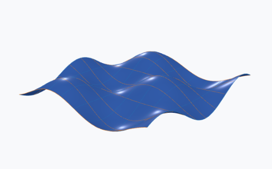
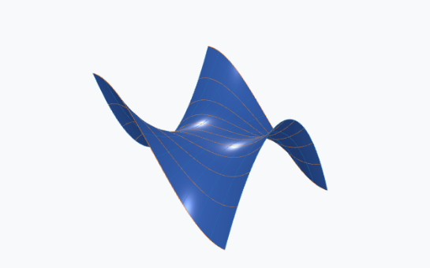
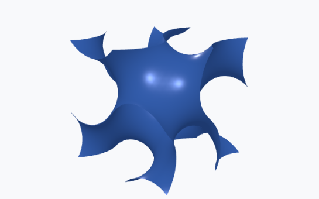
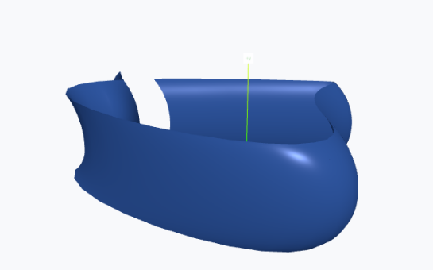
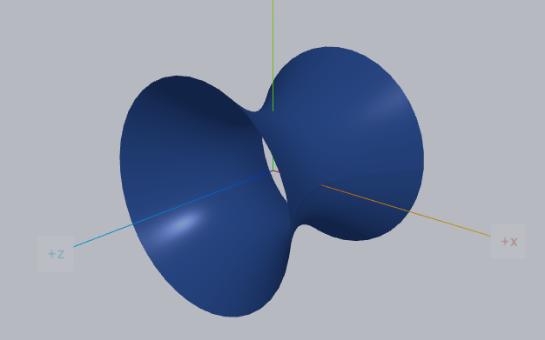
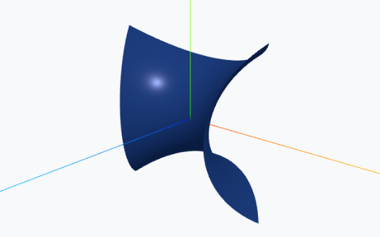
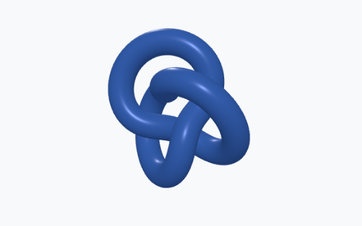

# Math3D

[](https://github.com/expert10000/Math3D/actions/workflows/ci-build-and-worker-smoke.yml) [](https://github.com/expert10000/Math3D/actions/workflows/docs-pages.yml) [](https://github.com/expert10000/Math3D/releases/latest) [](https://github.com/expert10000/Math3D/releases) [](https://github.com/expert10000/Math3D/blob/main/LICENSE)
[](https://deepwiki.com/expert10000/Math3D)

Math3D is an interactive geometry app (Electron + React) with browser mode support.

<p align="center">
  
</p>

## Highlights

- Explicit, implicit, parametric, spline, and Weierstrass surface workflows
- Interactive three.js viewport with geometry/object gallery
- Live procedural construction objects with dependency-graph recompute
- Python worker pipeline for CGAL/VTK-backed operations
- Desktop (Electron) and browser deployment modes

## Preview

<p align="center">
  
  
  
</p>
<p align="center">
  
  
  
</p>

Full gallery catalog: [GALLERY.md](GALLERY.md)  
Regenerate thumbnails with Playwright: `npm run test:app:e2e:thumbnails`

Live links:
- Web app: https://expert10000.github.io/Math3D/app/
- Landing page (hosted on GitHub Pages): https://expert10000.github.io/Math3D/landing/

Requirements:
- Node.js 24 or newer
- npm 10 or newer

Documentation:
- GitHub Pages: https://expert10000.github.io/Math3D/
- GitHub Wiki: https://github.com/expert10000/Math3D/wiki
- Developer notes and change log: [dev.md](dev.md)
- Repository folder guide: [docs/repository-layout.md](docs/repository-layout.md)

## Install

```bash
git clone https://github.com/expert10000/Math3D.git
cd Math3D
npm install
```

These commands only clone the repo and install Node dependencies. They do not start the app.

Quick start after install (pick one):
- Desktop from source: `npm run build` (or `npm run dev`)
- Browser local: `npm run dev:web`
- Browser + Docker: `docker compose -f docker-compose.web.yml up --build`

## Run

### Desktop dev mode (recommended for feature work)

Start desktop + renderer hot-reload together:

```bash
npm run dev
```

What this does:
- starts Vite renderer on `http://127.0.0.1:5174` (strict port)
- starts Electron main process and points it to that dev renderer

If you had old dev sessions open, close them first. If needed, clear stale local listeners on `5173-5176` before relaunching.

Windows note:
- if Electron ever starts in Node mode, clear this env var and relaunch:

```powershell
Remove-Item Env:ELECTRON_RUN_AS_NODE
```

Mesh benchmark location in dev mode:
- open right panel `Inspector`
- select `Object`
- scroll to `Mesh Performance`
- use benchmark buttons: `50k triangles`, `250k triangles`, `1M triangles`, etc.

### Geometry construction system

Procedural geometry mode supports dependent mathematical construction objects:
- midpoint, line, parallel, perpendicular, circle, angle bisector, tangent, and normal
- construction-to-construction chains such as `A/B -> midpoint -> circle -> tangent`
- live recompute through a dependency graph when source objects move
- dependency inspector nodes and edges for tracing construction inputs and outputs

### Run modes (quick guide)

| Mode | Where it runs | Worker/Python setup needed on host? | When to use |
| --- | --- | --- | --- |
| Desktop (installer, Windows) | Installed desktop app | No. Worker is embedded in installer build (`resources/python-worker/worker.exe`) | End-user desktop usage without local Python setup |
| Desktop (local source run) | Electron launched from repo | Yes by default for CGAL/VTK: Python + worker deps. Optional: use local `worker.exe` instead | Desktop development from source |
| Browser (local) | Your local browser + local Node proxy | Yes for CGAL/VTK: provide one backend (`worker.exe` or Python + deps) | Fast local web development and testing |
| Browser + Docker | Browser UI on host, backend in container | No on host. Backend is inside Docker image (Python venv + deps) | Self-contained, reproducible web runtime |

Worker setup details:
- Desktop installer (`npm run dist` output): bundled `worker.exe` is included, so no separate Python/worker install on user machine.
- Desktop local source run (`npm run build` / `npm run dev`):
  - default (`MATH3D_WORKER_MODE=auto`): uses Python script backend in dev, so install Python deps (`numpy scipy sympy pygalmesh vtk`)
  - optional exe path: `npm run build:python-worker` then set `MATH3D_WORKER_MODE=exe`
- Browser local (`npm run dev:web` or `npm run preview:web`): `/api/worker` proxy needs one local backend:
  - exe backend: `npm run build:python-worker` and set `MATH3D_WORKER_MODE=exe`
  - Python backend: install Python deps and use `MATH3D_WORKER_MODE=python` (or `auto`)
- Browser + Docker (`docker compose -f docker-compose.web.yml up --build`): container already provides Python backend; host machine does not need local worker/Python.

How `worker.exe` is created:
- Build command: `npm run build:python-worker` (runs `python python/worker/freeze.py` via PyInstaller).
- Output: `build/python-worker-dist/worker.exe`.
- Optional smoke verification: `npm run build:python-worker:smoke`.
- Installer packaging (`npm run dist`) already builds and embeds this artifact into `resources/python-worker/worker.exe`.

Environment variable notes:
- `MATH3D_PYTHON` affects runtime only for the Python-script backend.
- `MATH3D_PYTHON` does not control `npm run build:python-worker`; that build uses `python` from the active shell/PATH.
- Resolution defaults differ by runtime:
  - desktop local `auto` -> Python-script backend
  - browser local proxy `auto` -> prefer local `worker.exe`, fallback to Python-script backend

Python dev environment prep (Windows + Conda):
```powershell
conda create -n math3d-cgal python=3.11 -y
conda activate math3d-cgal
python -m pip install --upgrade pip
python -m pip install numpy scipy sympy vtk pyinstaller
python -m pip install pygalmesh
$env:MATH3D_PYTHON = (Get-Command python).Source
```

Notes:
- `pyinstaller` is needed when building `worker.exe` (`npm run build:python-worker`).
- `pygalmesh` is optional for many flows; if unavailable, `mesh.generate` may be unavailable while preview/VTK workflows still work.

### Desktop app (Electron)

```bash
npm run build:core
npm run build
```

For packaged installers:

```bash
npm run dist
```

Current packaged installer target is Windows (NSIS `.exe`).

### Browser app (web)

Development:

```bash
npm run dev:web
```

Production static build:

```bash
npm run build:web
npm run preview:web
```

Static output is written to `apps/web/dist/`.

### Browser app in Docker (self-contained)

```bash
docker compose -f docker-compose.web.yml up --build
```

Open:

- App: `http://localhost:4173`
- Worker diagnostics: `http://localhost:8787/api/worker/diagnostics`

Notes:
- This Docker flow is self-contained (Node + Python deps inside container).
- Linux containers use `python` worker mode; they do not run Windows `worker.exe`.

### Public frontend publish (GitHub Pages)

- CI deploys docs plus public frontends via `.github/workflows/docs-pages.yml`:
  - browser app: `https://expert10000.github.io/Math3D/app/`
  - landing page: `https://expert10000.github.io/Math3D/landing/`
- Manual local build for that Pages frontend layout:

```bash
npm run build:web:pages
```

Note:
- GitHub Pages serves static files only. Worker-backed API routes (`/api/worker`) are not included there unless you host a separate backend proxy/service.

### Public marketing site (independent app)

- Promo site source: `apps/public-site/src/`
- Promo site build output: `apps/public-site/dist/`
- Local dev: `npm run dev:public-site`
- Build: `npm run build:public-site`
- Preview build: `npm run preview:public-site`

## Python worker modes

Math3D browser mode uses a local proxy (`/api/worker`) for CGAL/VTK-backed operations.

### Self-contained worker (recommended)

Build bundled worker executable:

```bash
npm run build:python-worker
```

Run web mode with bundled executable backend:

```powershell
$env:MATH3D_WORKER_MODE = "exe"
npm run preview:web
```

### Python-script backend (optional)

Install worker dependencies:

```bash
python -m pip install numpy scipy sympy pygalmesh vtk
```

Optional Python path override:

```powershell
$env:MATH3D_PYTHON = (Get-Command python).Source
```

## Tests

```bash
npm --prefix renderer run test
npm run test:app:startup:smoke
npm run test:app:geometry:smoke
```

## Docs

```bash
npm run docs:build
```

## License

This project is licensed under Apache-2.0. See [LICENSE](LICENSE).
